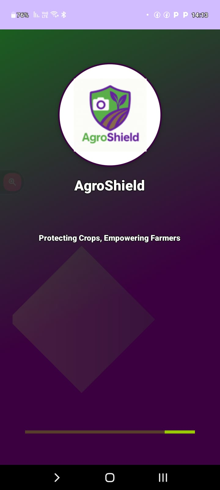
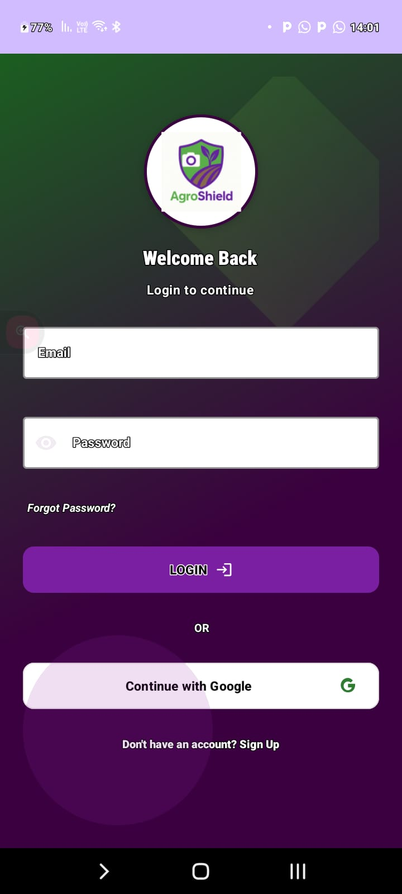
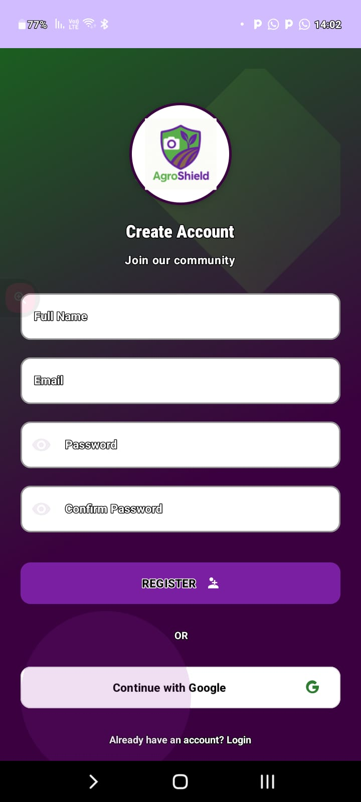
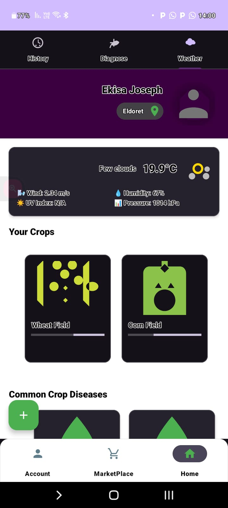
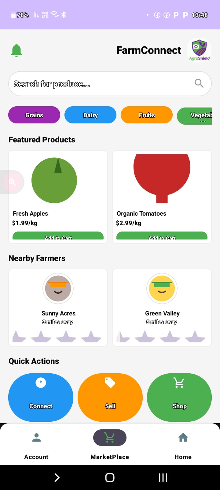

# AgroShieldApp

🌱 **Smart Farming Assistant**

AgroShield is an AI-powered mobile application designed to support smallholder farmers by providing rapid and accurate crop disease diagnosis using images of crop leaves. Leveraging a lightweight, pre-trained TensorFlow Lite model, the app works offline to detect various plant diseases caused by fungi, bacteria, viruses, and pests.

## Features

- **Offline Crop Disease Diagnosis**  
  Upload a photo of a crop leaf to instantly detect and diagnose plant diseases using AI, even without an internet connection.

- **Tailored Treatment Recommendations**  
  Receive specific, actionable treatment advice based on the diagnosed disease.

- **Climate-Smart Prevention Tips**  
  Access up-to-date agronomic advice for preventing future outbreaks, optimized for local climate conditions.

- **Marketplace Integration**  
  Seamlessly connect with trusted agrovet suppliers to purchase quality agricultural inputs directly from the app.

- **Agrovet Locator**  
  Use the built-in map to find the nearest agrovet stores using your device's location services.

- **Designed for Rural Use**  
  Lightweight, works offline, and optimized for regions with limited internet and agronomic support.

## Benefits

- Early detection and timely treatment reduce crop losses.
- Improves farmer incomes and promotes sustainable, climate-resilient agriculture.
- Bridges the gap for rural farmers with limited access to expert advice and quality agri-inputs.

---

## Demo

Below are screenshots demonstrating key features of AgroShield:

|splash Screen| Login/Sighnup | Home Screen | 
||  |  | |  |

|Marketplace|

 |  |
*Screenshots are for demonstration purposes. Actual app UI/UX may vary as development progresses.*

---

## Getting Started

1. **Clone the repository**  
   ```bash
   git clone https://github.com/Ekisa02/AgroShieldApp.git
   ```

2. **Open in Android Studio**  
   Open the project in [Android Studio](https://developer.android.com/studio). Ensure you have the latest SDKs installed.

3. **Build & Run**  
   - Connect your Android device or use an emulator.
   - Build and run the project.

4. **Model & Data**  
   - The TensorFlow Lite model is included in the `assets` directory.
   - For best results, ensure your device camera permissions are enabled.

---

## Contributing

Contributions are welcome! Please open issues or submit pull requests for features, bug fixes, or improvements.

---

## License

[MIT](LICENSE)

---

## Contact

For questions, partnership, or support, please open an issue or contact the maintainer via GitHub.
